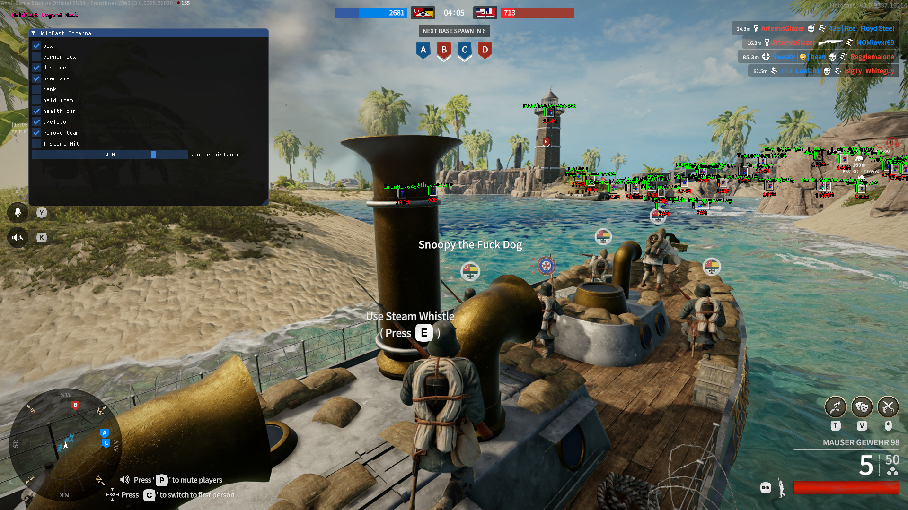

# HoldFast: Nations At War — Internal Cheat

> **Disclaimer**  
> This project is intended *strictly for educational purposes only*.  
> It demonstrates concepts in **reverse engineering** and **game memory manipulation**.  
> **Do not** use this in multiplayer or live environments.

---

## Auto-Updating SDK

This project includes an auto-updating SDK that keeps the cheat compatible with the latest game patches with minimal manual intervention.

**Video Overview**: [https://www.youtube.com/watch?v=POLJRNmHXnM&t](https://www.youtube.com/watch?v=POLJRNmHXnM&t)

---

## Features

### Visuals

* **Box**  
* **Corner Box**  
* **Skeleton**  
* **Distance**  
* **Health Bar**  
* **Username**  
* **Platform Type**  
* **Held Item**  
* **Rank**  
* **Remove Team**

---

## Notes

* Internal-only cheat for improved performance and stability  
* Uses ImGui for rendering  
* Modular architecture for easy feature toggling  
* Designed for learning about memory manipulation and SDK generation
